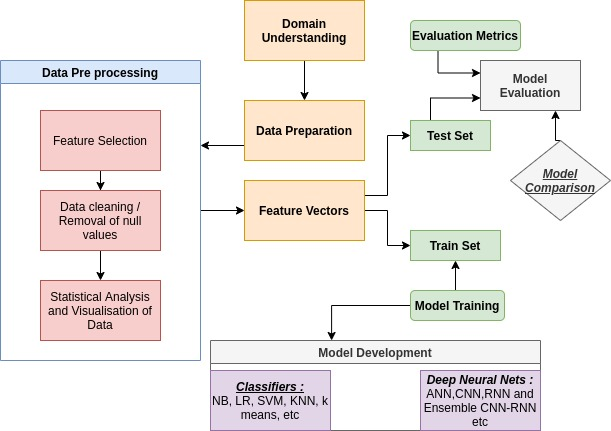
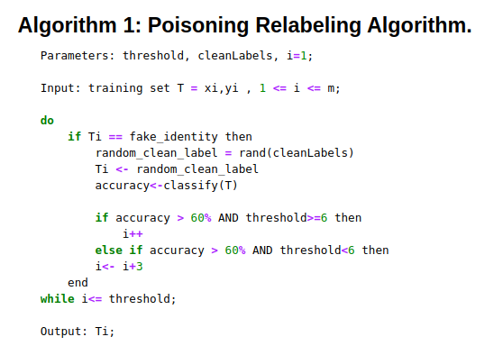
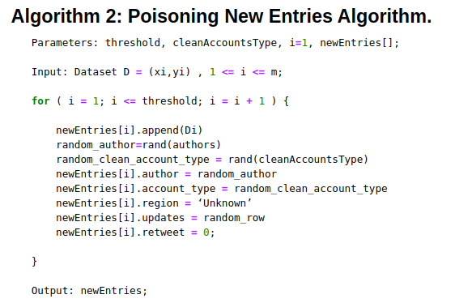
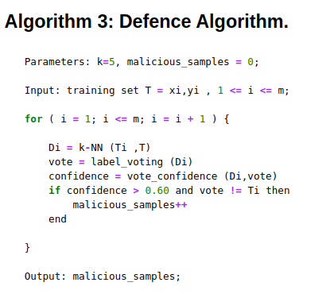

# Intrusion-Detection-System-Adversarial-Attacks-

## *1. A comparative study of classifiers and deep neural networks applied to Intrusion detection systems with a focus on network based anomaly detection(CSE-CIC-IDS2018 dataset)* ##

## *2. Exploration of Adversarial attacks on Network Intrusion Detection Systems using CSE-CIC-IDS2018 dataset * ##

**The Methodology/Pipeline of the system is illustrated below :**

* Data Preprocessing
* Model Training
* Model Testing and Evaluation

### Machine Learning Classifiers :
1. Multinomial Naive Bayes
2. Logistic Regression
3. Support Vector Machines ( linear and Radial basis function )
4. K-Nearest Neighbours
5. K-means Clustering
6. Random Forest 
7. Gradient Boosting 
8. XGBoost 
9. Decision Tree 

### Deep Learning Algorithms : 
1. ANN 
2. CNN 
3. RNN {Bidirectional LSTM - GRU's}
4. Ensemble DNN (CNN - RNN) 

### Metrics for Evaluation : 
1. **Accuracy**
2. **f1-Score**
3. **Precision**
4. **Recall**
5. **ROC-AUC**
6. **Error and Loss**

---

# Adversarial Attacks - 
1. **Label Flipping**

---

2. **Fake Data Addition**

---

## Adversarial attacks defensive mechanism :
1. **Application of KNN as Defence**

---

